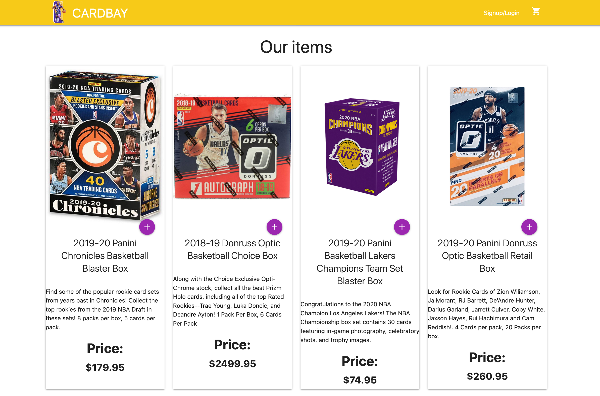
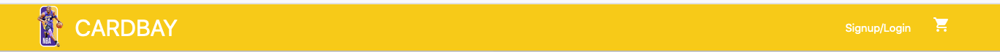
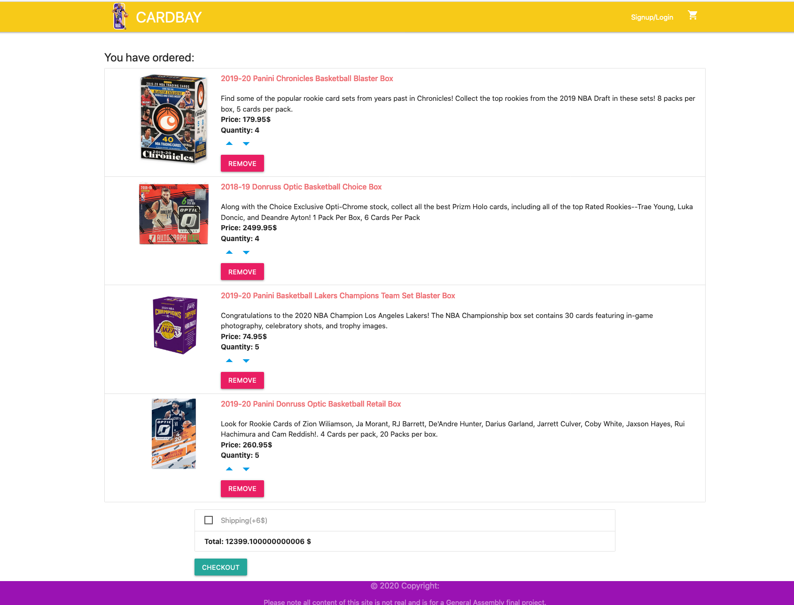
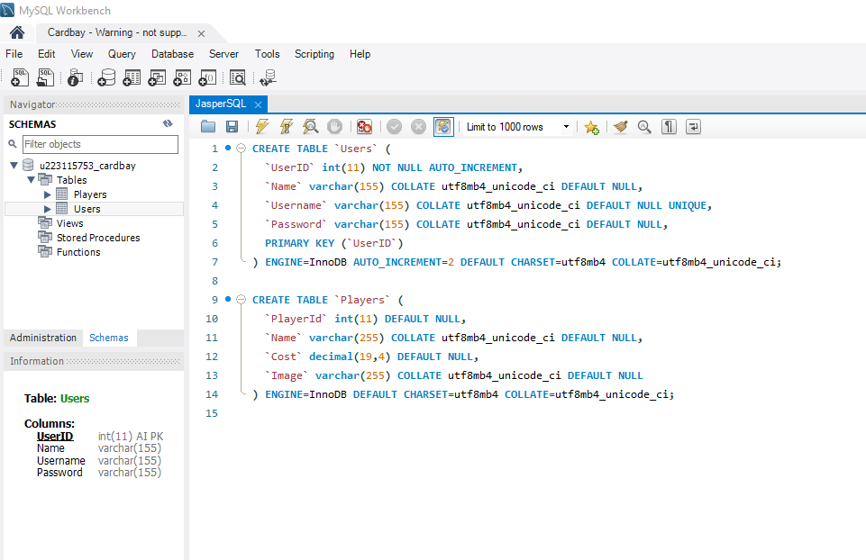

----
# . SEI-38 Final Project: CARDBAY

This was developed as part of SEI 38 for my final project, the goal was to build a web application from scratch, to show off what I have learned over my short, yet intense three month 'coding-bootcamp' at General Assembly. The type of web application I chose to create was completely up to me as well as the tech stack.

There were a few prerequisite's conditions for the app, they are as follows:

You can see the site **[HERE](https://frozen-taiga-03219.herokuapp.com/).**

-----

## FRONT-END
---
### Home

The Home page, lists the items for sale and allows the customer to view, photo's, descriptions and price of the products we stock.

.

---
#### Nav-Bar

The Nav-bar, gives links to the cart where a customer can see the products they have added to their cart, also both the logo and 'CARDBAY' redirect to the home page. Signup/Lopin will be a pop up window once completed at the moment it is a dead Link.

.

---
#### Cart

The Cart is where a customer can view all the products that they have added, and can see the total costs of their order having the option  to subtract or add items to their cart. As well as a shipping button that adds a shipping tax.

(Square API Coming)

.

-----

## BACKEND
---

## MySQL

 'MySQL Workbench' was used to edit the MySQL for the backend to store user login details in a table:
 - Name
 - Username
 - Password

 As well as a Player ID Table:
 - Name
 - Cost $$$$
 - Image

 Both Features are ready to be implemented, ran out of time so aren't ready for this demo unfortunately.

 .

---

## FUTURE FEATURES

- Complete Login/signup with MYSQL Tabels
- Implement Square API for Payments
- Create An Accounts page & develop a CRUD system for users to add their own products
- Link Cloudinary for photo uploads once CRUD system is in place
- Add a search bar into the NavBar using the PlayerID table to spit out results  
- Polish up

---

## Tech Stack
**Languages:** HTML, CSS, and Javascript  
**Frameworks:**  React  
**Back-end Server:** MySQL  
**Front-end Hosting:** Herroku
**Other:**  React-redux

---

## Special thanks to Joel, Camilla & the GA TEAM.
